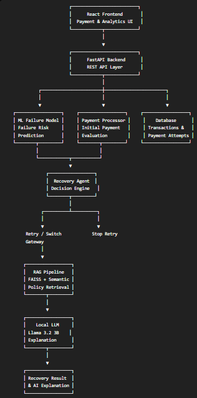

# AI Payment Reliability & Recovery Agent

## 1. Problem Statement

Online payment systems frequently experience failures due to network errors, bank timeouts, gateway errors, risk blocks, and insufficient funds. In conventional payment systems, a failed transaction is often immediately reported to the user without intelligently determining whether the transaction can be recovered.

This can lead to:

- Lost or abandoned transactions
- Repeated unsuccessful payment attempts
- Poor customer experience
- Inefficient use of available payment gateways
- Lack of transparency behind recovery decisions

Therefore, there is a need for an intelligent payment reliability system that can **predict payment failures, understand their causes, determine whether recovery is possible, select an appropriate recovery strategy, and explain the decision.**

---

## 2. Proposed Solution

We propose an **AI-driven Payment Reliability & Recovery Agent** that combines **Machine Learning, Agentic Decision Making, Retrieval-Augmented Generation (RAG), and a Large Language Model (LLM)** into a single end-to-end payment recovery pipeline.

The system works as follows:

- **Machine Learning** predicts the probability of payment failure using transaction, gateway, response-time, history, device, and risk-related features.
- **Payment Processor** simulates and evaluates the initial payment attempt and identifies the failure reason.
- **AI Recovery Agent** analyzes the payment context and failure reason to determine the appropriate recovery action, such as retrying the payment, switching to an alternate gateway, or stopping further retries.
- **RAG Pipeline** retrieves relevant payment recovery policies from the knowledge base using semantic similarity and FAISS.
- **Local LLM** uses the transaction context, recovery decision, and retrieved policies to generate a human-readable explanation of why the payment failed and why the recovery strategy was selected.
- **Database & Analytics** store transactions and individual payment attempts and provide recovery and gateway performance analytics through the dashboard.

The complete pipeline is:

Payment Request
      ↓
ML Failure Prediction
      ↓
Payment Processing
      ↓
Failure Detection
      ↓
AI Recovery Agent
      ↓
Recovery Decision
      ↓
RAG Policy Retrieval
      ↓
Local LLM Explanation
      ↓
Transaction & Recovery Analytics

## 3. System Architecture

## 4. Technology Stack
Component	              Technologies
Frontend	              React, Vite, JavaScript, CSS, Recharts
Backend	                Python, FastAPI
Database	              SQLAlchemy, Relational Database
Machine Learning	      Scikit-learn, Pandas, Joblib
Recovery Agent	        Python-based Agentic Decision Logic
RAG	                    Sentence Transformers, FAISS
Knowledge Base	        Payment Recovery Policy Documents
LLM	                    Llama 3.2 3B Instruct, Local LLM API
API Communication	      REST APIs
Version Control	        Git, GitHub

